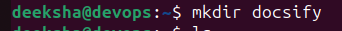
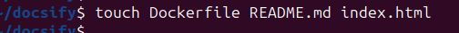
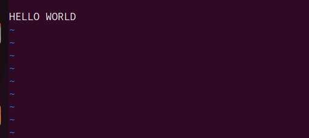
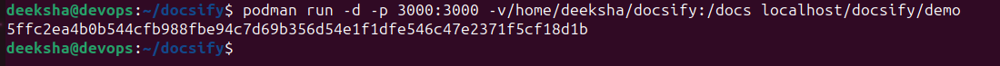
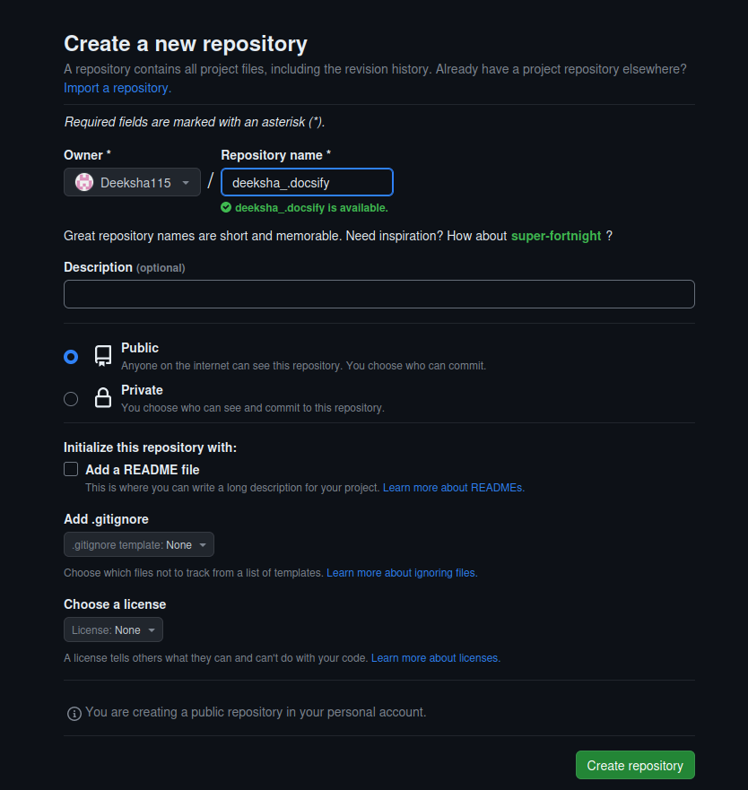
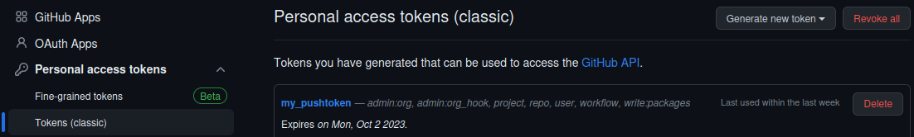
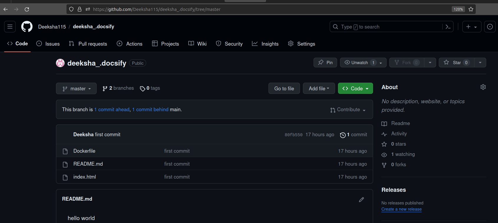

# <p style="text-align: center;"> DOCSIFY SETUP IN PODMAN AND  INTEGRATION WITH GITHUB</p> 


#### Introduction 

- **Docsify:**  is a documentation site generator that allows you to create beautiful, searchable documentation websites using Markdown files.

- **Docsify:** generates your documentation website on the fly. Unlike GitBook, it does not generate static html files. Instead, it smartly loads and parses your Markdown files and displays them as a website. To start using it, all you need to do is create an index.html and deploy it on GitHub Pages.


#### Linux Distribution: 

- Distributor ID:  Ubuntu
- Version: 23.04

#### System Configuration:

- RAM : 4GB
- CPU :  4 CORE
- STORAGE : 1TB


#### Overview


- [Podman](#overview)

- [Github](#purpose)

- [podman_install](#podmaninstall)

- [Github_interagation](#Githubinteragation)

## Podman 

* The podman is pod manager tool and that's why the name is podman
* The name pods came from the Kubernetes.Collection of containers or Grouping of containers are called as pods
* The main reason for creating podman is to lavering the concept of pods where you have two containers run together mostly called them as a side car pattern . So we can use podman to run two different containers together.


## Github 

* GitHub is an online software development platform. It's used for storing, tracking, and collaborating on software projects.
* Github is an Version Control system 


### Step 1 - Update Your System

```
sudo apt update
```


### Step 2 - Podman Installation 

```
 sudo apt-get install -y podman
```


---------------------------------------------------------------------------
- **Note:**  If you have not installed podman so you can use these command given below ➖
  
--------------------------------------------------------------------------

```
$ sudo sh -c "echo 'deb https://download.opensuse.org/repositories/devel:/kubic:/libcontainers:/stable/xUbuntu_$(lsb_release -rs)/ /' > /etc/apt/sources.list.d/devel:kubic:libcontainers:stable.list"


$ wget https://download.opensuse.org/repositories/devel:/kubic:/libcontainers:/stable/xUbuntu_$(lsb_release -rs)/Release.key


$ sudo apt-key add - < Release.key


$ sudo apt update


$ sudo apt install -y podman


$ podman --version

```


 **sudo:** This part of the command is like saying "I want to do something important." It stands for "superuser do" and allows you to perform tasks that affect your computer's system, like installing software.

 **apt-get:** Think of this as a magic tool that helps you add, update, and remove programs (software) on your computer. It's how you manage what software is installed.

**install:**  This tells the magic tool that you want to put a new program on your computer.

**y:**  The -y is like saying, "Yes, go ahead!" It tells the magic tool to answer "Yes" to any questions it might ask during the installation, so you don't have to type "Yes" manually.

### Step 3 - Check Podman Version

```
 podman --version
```


**podman:**  This is the name of the program or tool 


**When you run podman --version,** Podman responds by showing you a number (e.g., "2.2.1"). This number represents the version of Podman that's currently installed. Knowing the version is helpful because different versions might have different features or behave in slightly different ways, so it's useful information if you're troubleshooting or working with Podman.

### Step 4 - Create a Directory

```
 mkdir docsify
```



**mkdir:**  This is a command that stands for "make directory." It tells your computer that you want to create a new folder.

after creating a Directory name which is docsify and enter in the directory with command given below 


```
cd docsify 
```
**cd:**  This command is used to enter the directory 


### Step 5 - Create File In Directory

```
touch index.html
touch Dockerfile
touch README.md
```


**touch:** This is a command that tells your computer to create a new file.
After creating the file we will check the file is the command of 

```
ls 
```
**ls:** This  command is used to see the files inside the directory
### Step 6 - Open/Edit and paste the index.html syntex 


##### Use apt to install Vim:
```
sudo apt install vim

```


**-vim:** This is the command to launch the Vim text editor.

```
 vim index.html
```


```
<!DOCTYPE html>
<html>
  <head>
    <meta http-equiv="X-UA-Compatible" content="IE=edge,chrome=1" />
    <meta name="viewport" content="width=device-width,initial-scale=1" />
    <meta charset="UTF-8" />
    <link
      rel="stylesheet"
      href="//cdn.jsdelivr.net/npm/docsify@4/themes/vue.css"
    />
  </head>
  <body>
    <div id="app"></div>
    <script>
      window.$docsify = {
        //...
      };
    </script>
    <script src="//cdn.jsdelivr.net/npm/docsify@4"></script>
  </body>
</html>
```
## output 


**- vim:**  This is the command to launch the Vim text editor.

### STEP 7 - Open/Edit and paste the Dockerfile 

```
 vim Dockerfile
```


```
FROM node:latest
  LABEL description="A demo Dockerfile for build Docsify."
  WORKDIR /docs
  RUN npm install -g docsify-cli@latest
  EXPOSE 3000/tcp
  ENTRYPOINT docsify serve .

```
## Output 


### STEP 8 - This file is used to show the information about project 

```
 vim README.md

```

## Output




### Step 9 - Podman build image

```
 podman build -f Dockerfile -t docsify/demo .

```


## Output


**- Podman build image"** in simple words means creating a container image using Podman, which is a tool for managing containers (like virtualized software environments). Here's a breakdown:

**- Podman:** This is the tool you're using. It's similar to Docker and helps you work with containers.

**- Build:** This means you're instructing Podman to build something. In this case, you're telling it to construct a container image.


### Step 10 - Podman run 

```
podman run -d -p 3000:3000 -v/home/deeksha/docsify:/docs localhost/docsify/demo

```


**run:**  This part of the command tells Podman that you want to start and run a container with a specific image.

### Step 11 - Container Check 


```
podman ps 
```

This command is used to check the running  container 

### Step 12 - Preview  


- Here you can hit browser localhost:3000/
- localhost:3000/


## GITHUB 


-  Create a github  account and make a repository. To create a GitHub account Go to https://github.com/ Click on "Sign up" and follow the prompts to create your account then  Login github 

#### Login to the github 

 .


###  We will create a new repositories

- Go to the new section for create new repositories 


- Choose a name for your repository. Then Write a short description about your project or documentation. Choose whether the repository should be public or private. Then click create a repository.

#### Create your repository name 
- click public if Anyone on the internet can see this repository. You choose who can commit.
- click private You choose who can see and commit to this repository.
- Add a README.md file this is where you can write a long description for your project




#### Generate a token to be used as a password when executing the git push -u origin master command.
- Open setting


##### Go to the Developer settings

#### Select Personal access token (Classic version)


#### And tap Token (classic)

#### Go to the right side and click generate new token


#### Now  generate new token(classic)


#### you have to give the name and expire date of your token and select the boxes 

#### After select the boxes as per your needed 
##### click the generate token 


#### your token has been created


#### create a new repository on the command line

- **git init** :- "git init" is like setting up a magic box that remembers all the changes you make to your files, so you can easily go back and see what you did later.


- **git add README.md** :-  Command is used to tell Git that you want to include the changes you've made to the README.md file


- **git commit -m "first commit"** :-  Is like saving your work and adding a quick note to remember what you did. It's like taking a snapshot and writing a caption for it.


- **git branch -M master** :-  (git branch) This tells Git you want to work with branches, which are different versions of your project.(M) This is a flag that means you're renaming or moving a branch.(master) This is the name of the branch you're renaming. In Git, "master" is often the default starting point.


- **git remote add origin <https://github.com/Deeksha115/deeksha_.docsify.git>** :- This command is saying, "Git, I want to connect my local project to a place on GitHub called 'origin' using this web address.


- **git push -u origin master** :- Is like sending your local work to your online project's home on GitHub. It's a way to share your changes and keep everything in sync. The -u part helps set up a connection for next time.

## Output


- After pushing you may have to fill username or password of github 
- Username: Deeksha115
- Password : (token id)


#### You can see your all file in master branch 

#### Reference link : https://docsify.js.org/#/?id=docsify


